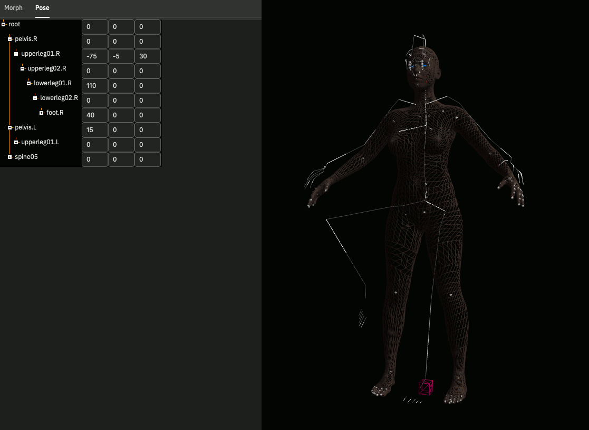

# makehuman.js

  

  An **experimental** port of [Makehuman](http://www.makehumancommunity.org) to Typescript/The Web.

## Current Status

* Totally unusable work in progress. 😅
* As of 2021-06-06 I succeeded to make some modifiers work.
* The UI is done with [toad.js](https://github.com/markandre13/toad.js#readme) and needs the variant in git master.
  (Say "Hi!" to `npm link`)

## Why?

* I've been using MakeHuman for more than a decade but often struggled with the UI and the source code.
* I'm up to [something](https://mark13.org) with [Blender](https://www.blender.org) and [Chordata](https://chordata.cc) and in need for full artistic control of my toolchain. 😎

## Similar Projects

* [makehuman-js](https://github.com/makehuman-js/makehuman-js) Another port of Makehuman to the Web. Close to the original.
