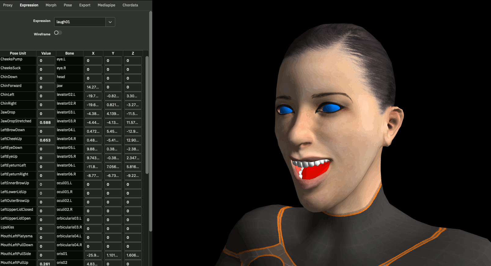

# makehuman.js

<div style="text-align:npm center">
  

  A variation of [Makehuman](http://www.makehumancommunity.org) as a WebApp.
</div>

## Current Status

* Have a look at [build 2023-05-13](https://markandre13.github.io/makehuman.js/)
* Morph mesh
* Pose skeleton and adjust mesh
* Select one of 32 pre-defined facial expressions
* Render a proxy mesh instead of the basemesh
* Export the mesh with rig and texture coordinates as Collada for Blender
* Nothing else... 😅

Currently working on:

* pose/animate the face with Google's [MediaPipe](https://developers.google.com/mediapipe) 
* pose/animate the body with [Chordata](https://chordata.cc)

both will require building some C++ code from
[mediapipe_cpp_lib](https://github.com/markandre13/mediapipe_cpp_lib) and
[mediapipe_daemon](https://github.com/markandre13/mediapipe_daemon)

Build steps are currently:

* npm install
* npm run dev:prepare
* npm run dev:build
* npm run dev:serve (in another terminal)

## Why?

* I've been using MakeHuman for more than a decade but often struggled with the UI and the source code.
* I'm up to [something](https://mark13.org) with [Blender](https://www.blender.org) and [Chordata](https://chordata.cc) and in need for full artistic control of the toolchain. 😎

## How does Makehuman work?

### Morph

#### Data

* data/3dobjs/base.obj contains a 3d model of a human body, called the **base mesh**.

  It is completely made of quads, which well give good results when applying
  a Catmul and Clark subdivision to it.

  Further reading: [Mesh Topology](http://www.makehumancommunity.org/wiki/Documentation:Professional_mesh_topology).

* data/target/ contains 1258 [morph targets](https://en.wikipedia.org/wiki/Morph_target_animation),
  which can deform the base mesh's shape, gender, age and ethnicity.

  The morph targets are handmade by editing the basemesh in a 3d editor and
  extracting the changes with [MakeTarget](https://github.com/makehumancommunity/maketarget-standalone).

* data/modifiers/ bundles those morph targets into 249 more user friendly **modifiers**

#### Code

```js
// render's the morphed base mesh
function render(canvas: HTMLCanvasElement, scene: HumanMesh)

// the morphed base mesh
class HumanMesh {
    // input
    obj: Mesh        // the base mesh from the Wavefront Object
    human: Human     // the morph targets

    // processing
    update()         // calculate vertex from obj and human

    // output
    vertex: number[] // the morphed obj.vertex
}

// aggregates all the modifiers and creates a list of morph targets
class Human {
    // input
    modifiers: Map<string, Modifier>
    modifierGroups: Map<string, Modifier[]>

    // output 
    targetsDetailStack: Map<string, number> // morph targets

    // for posing and skinning (see below)
    meshData!: WavefrontObj
    __skeleton!: Skeleton
}

// creates a list of ui elements (sliders, text fields) to edit the modifier values
function loadSliders(filename: string)
```

### Pose

The skeleton aggregates bones and weights. Bones can be rotated.

Posing the skeleton directly, especially those in the face, can be a bit tedious. Hence there are pre-defined _pose units_, e.g. "LipsKiss" or "HandBendOutLeft", which can control multiple bones at once while also restricting bone movement.

#### Data

* Skeleton

  * data/rigs/default.mhskel the bones making up the skeleton

    For the actual bone positions little cubes within the mesh are referenced,
    so when the mesh is morphed, the skeleton is morphed along with it.

    Further reading: [Base Mesh and Rig](http://www.makehumancommunity.org/wiki/Documentation:Basemesh).
  
  * data/rigs/default_weights.mhw the weights each bone has on each vertex

* Pose Units

  * data/poseunits/body-poseunits.json defines 63 pose units for the body.

  * data/poseunits/face-poseunits.bvh and face-poseunits.json defines 60
    pose units for the face.

  * data/expressions/*.mhpose defines 32 face expressions based upon pose
    units, e.g. like "laugh01" or "fear02".

#### Code

```js
// aggregates the bone tree and weight list
class Skeleton {
}

// a single bone
class Bone {
    parent?: Bone
    children: Bone[] = []

    name: string

    yvector4?: vec4 // direction vector of this bone (along y-axis)
    matRestGlobal?: mat4 // bone relative to world
    ...

    // user defined rotation
    matPose: mat4
}

// weights
class VertexBoneWeights {
    // bone name -> [[vertex numbers, ...], [weight for vertex, ...]]
    _data: Map<string, Array<Array<number>>>
}
```

### Proxy

Proxies provide additional meshes, e.g. teeth, tounge, eyes, alternative body
meshes and cloth.

The proxy files contain data which is used to transform the morphed/posed basemesh into a proxy mesh.
These files are created with [MakeClothes](https://github.com/makehumancommunity/community-plugins-makeclothes).

```js
class Proxy {
    // return proxy mesh vertices, adjusted to basemesh morph/pose
    getCoords(baseMeshVertices: number[]): number[]
}
```

## Build

Building needs toad.js from the github master branch. See 'npm link' for further details.

Building is currently done with [ttypescript](https://www.npmjs.com/package/ttypescript) without
any bundler.

Due some changes in typescript 5 neither ttypescript nor ts-patch work anymore.

Here's the relevant discussion:

* https://github.com/cevek/ttypescript/issues/140
* https://github.com/nonara/ts-patch/issues/93
* https://github.com/microsoft/TypeScript/issues/52826
* https://github.com/microsoft/TypeScript/issues/52953

## Run single test

npm run dev:test --file=build/test/skeleton.spec.js

## Next Goals

* save/load morph
* save/load pose
* posing via mediapipe/chordata (Done: PoC reading data in C++)
  https://github.com/markandre13/mediapipe_cpp_lib
* multiple proxy meshes
* texture
* ...

<!--

TODO
[X] the the other meshes/proxy meshes
[X] export UV
[ ] export multiple meshes
    (e.g. for clothing; or to separate skin/teeth/tounge/eyes for better Blender compability)
[ ] load expression (e.g. data/expressions/laugh01.mhpose) ?
[ ] load pose (eg. data/poses/sit01.bvh) ?
[ ] export animation
[ ] select proxy, ...
[ ] load/save *.mhm (that's the textfile )
[ ] export normals
[ ] ...

-----

// the morphed base mesh
HumanMesh {
    human: Human

    obj: Mesh // aka WavefrontObj
    origVertex: number[]
    vertex: number[]
    indices: number[]
    groups: Group[]

    proxy?: Proxy
    proxyMesh?: WavefrontObj

    update() {
        this.vertex = [...this.origVertex]
        // morph this.vertex
        // update skeleton to new morph (temporarily set this.obj.vertex = this.vertex)
        // skin this.vertex (this.human.__skeleton.skinMesh(...))
    }
}

render() will use the proxy mesh

// aggregates all the modifiers and creates a list of morph targets
Human: AnimatedMesh {
    meshData: WavefrontObj // Object3D(name)

    def addBoundMesh(self, mesh, vertexToBoneMapping):

    getRestCoordinates(name) {
        rIdx = self._getBoundMeshIndex(name)
        self.__originalMeshCoords[rIdx][:,:3]
    }

    setProxy()
    setHairProxy()
    setEyesProxy()
    setEyebrowsProxy()
    setEyelashesProxy()
    setTeethProxy()
    setToungeProxy()
    addClothesProxy()
    removeClothesProxy()
}

how upstream Makehuman does it...

## Makehuman

```
cd /Users/mark/upstream/makehuman/makehuman
./makehuman
pip3.9 install --upgrade --force-reinstall PyQt5
```

-->
