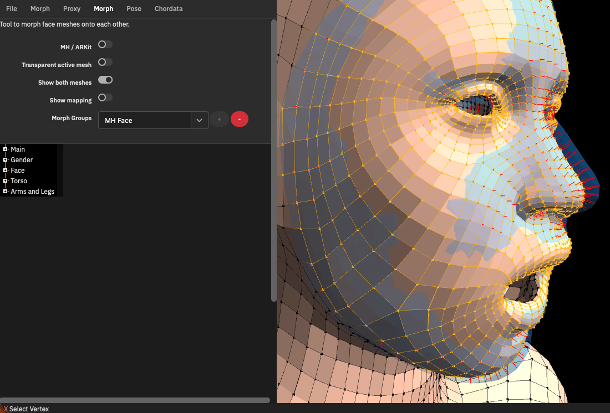

# makehuman.js

A [Makehuman](http://www.makehumancommunity.org) variant with different features.

<div style="text-align:npm center">
  
</div>

## Currently Working On

Animation!

* Face animation with
[MediaPipe](https://developers.google.com/mediapipe)'s Face Landmarker
* Body animation with [Chordata](https://chordata.cc)

This needs the [makehuman.js backend](https://github.com/markandre13/makehuman.js-backend) to be running locally.

Once that is working, the next step will be to record animations and export them to Blender.

## Current Status

* Have a look at [build 2023-10-31](https://markandre13.github.io/makehuman.js/)
* Edit, load and save morph
* Pose and load pose
* Select one of 32 pre-defined facial expressions and/org edit facial pose units
* Render various proxy meshes instead of the basemesh
* Export the mesh with rig and texture coordinates as Collada for Blender
* Nothing else... 😅

## How to build

* npm install
* npm run dev:prepare
* npm run dev:build
* npm run dev:serve (in another terminal)

## Why?

* I've been using MakeHuman for more than a decade but often struggled with the UI and the source code.
* I'm up to [something](https://mark13.org) with [Blender](https://www.blender.org) and [Chordata](https://chordata.cc) and in need for full artistic control of the toolchain. 😎

## Animation

### Capturing

* [MediaPipe](https://developers.google.com/mediapipe)

  Contains image recognition for facial landmarks, fingers and body.

* [Chordata](https://chordata.cc)

  Body pose capturing using 15 or 17 MARGS (accelerometer + gyroscope + magnetometer) attached to the body.

* [The FreeMoCap Project](https://freemocap.org)

  Not used in makehuman.js (yet): Python project which bundles and extends various free motion capture tools.

### Face

* https://en.wikipedia.org/wiki/Facial_Action_Coding_System

* Siggraph 2021 [3D Morphable Face Models - Past, Present and Future](https://youtu.be/UGtIwWv1dds?si=-FJNP9f_wYKuuPCc)

  * https://github.com/3d-morphable-models/curated-list-of-awesome-3D-Morphable-Model-software-and-data

* MakeHuman uses a facial rig, which can be animated by combining 60 predefined poses (aka. pose units)

* Google Mediapipe / Apple ARKit / ...

  52 Blendshapes/Morph Targets

  * https://hinzka.hatenablog.com/entry/2021/12/21/222635#Blendshapes-LIST
  * https://arkit-face-blendshapes.com
  * https://github.com/ICT-VGL/ICT-FaceKit
    Here's how the data can look:
    * https://news.productioncrate.com/free-3d-facial-expression-blendshapes-pack/
    * Video: https://youtu.be/QAa2j-B2fa4?si=4d_xlBEOfO2FbOAg

### Body

TBD

## How does Makehuman work?

### Morph

#### Data

* data/3dobjs/base.obj contains a 3d model of a human body, called the **base mesh**.

  It is completely made of quads, which well give good results when applying
  a Catmul and Clark subdivision to it.

  Further reading: [Mesh Topology](http://www.makehumancommunity.org/wiki/Documentation:Professional_mesh_topology).

* data/target/ contains 1258 [morph targets](https://en.wikipedia.org/wiki/Morph_target_animation),
  which can deform the base mesh's shape, gender, age and ethnicity.

  The morph targets are handmade by editing the basemesh in a 3d editor and
  extracting the changes with [MakeTarget](https://github.com/makehumancommunity/maketarget-standalone).

* data/modifiers/ bundles those morph targets into 249 more user friendly **modifiers**

#### Code

```js
// render's the morphed base mesh
function render(canvas: HTMLCanvasElement, scene: HumanMesh)

// the morphed base mesh
class HumanMesh {
    // input
    obj: Mesh        // the base mesh from the Wavefront Object
    human: Human     // the morph targets

    // processing
    update()         // calculate vertex from obj and human

    // output
    vertex: number[] // the morphed obj.vertex
}

// aggregates all the modifiers and creates a list of morph targets
class Human {
    // input
    modifiers: Map<string, Modifier>
    modifierGroups: Map<string, Modifier[]>

    // output 
    targetsDetailStack: Map<string, number> // morph targets

    // for posing and skinning (see below)
    meshData!: WavefrontObj
    __skeleton!: Skeleton
}

// creates a list of ui elements (sliders, text fields) to edit the modifier values
function loadSliders(filename: string)
```

### Pose

The skeleton aggregates bones and weights. Bones can be rotated.

Posing the skeleton directly, especially those in the face, can be a bit tedious. Hence there are pre-defined _pose units_, e.g. "LipsKiss" or "HandBendOutLeft", which can control multiple bones at once while also restricting bone movement.

#### Data

* Skeleton

  * data/rigs/default.mhskel the bones making up the skeleton

    For the actual bone positions little cubes within the mesh are referenced,
    so when the mesh is morphed, the skeleton is morphed along with it.

    Further reading: [Base Mesh and Rig](http://www.makehumancommunity.org/wiki/Documentation:Basemesh).
  
  * data/rigs/default_weights.mhw the weights each bone has on each vertex

* Pose Units

  * data/poseunits/body-poseunits.json defines 63 pose units for the body.

  * data/poseunits/face-poseunits.bvh and face-poseunits.json defines 60
    pose units for the face.

  * data/expressions/*.mhpose defines 32 face expressions based upon pose
    units, e.g. like "laugh01" or "fear02".

#### Code

```js
// aggregates the bone tree and weight list
class Skeleton {
}

// a single bone
class Bone {
    parent?: Bone
    children: Bone[] = []

    name: string

    yvector4?: vec4 // direction vector of this bone (along y-axis)
    matRestGlobal?: mat4 // bone relative to world
    ...

    // user defined rotation
    matPose: mat4
}

// weights
class VertexBoneWeights {
    // bone name -> [[vertex numbers, ...], [weight for vertex, ...]]
    _data: Map<string, Array<Array<number>>>
}
```

### Proxy

Proxies provide additional meshes, e.g. teeth, tounge, eyes, alternative body
meshes and cloth.

The proxy files contain data which is used to transform the morphed/posed basemesh into a proxy mesh.
These files are created with [MakeClothes](https://github.com/makehumancommunity/community-plugins-makeclothes).

```js
class Proxy {
    // return proxy mesh vertices, adjusted to basemesh morph/pose
    getCoords(baseMeshVertices: number[]): number[]
}
```

## Development

    # install packages
    npm install

    # populate data directory

    (I run this outside the Visual Studio Code terminal, to get access to my
    local Makehuman installation to avoid downloading all assets from the net.)

    npm run dev:prepare

    # run (in separate terminals)
    npm run dev:build
    npm run dev:serve

## Run single test

    npm run dev:test --file=build/test/skeleton.spec.js
